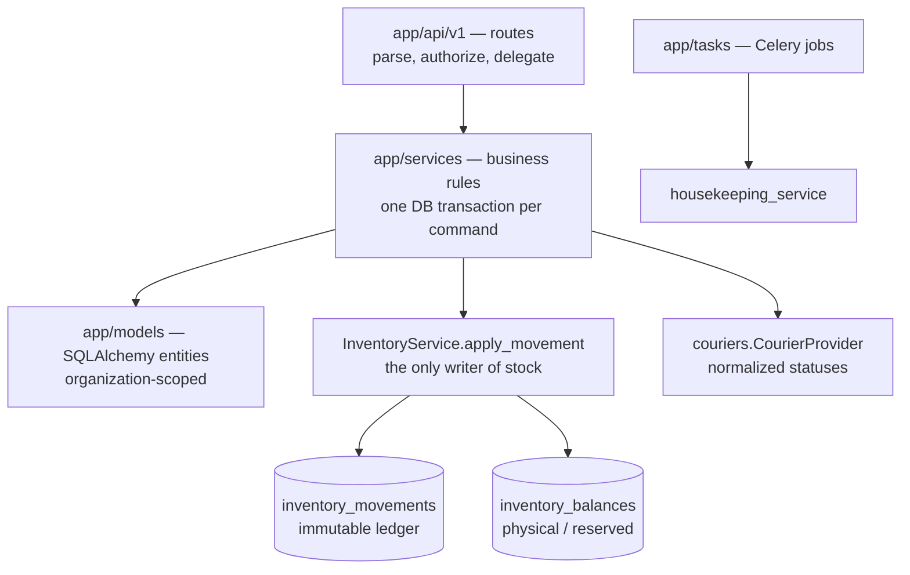
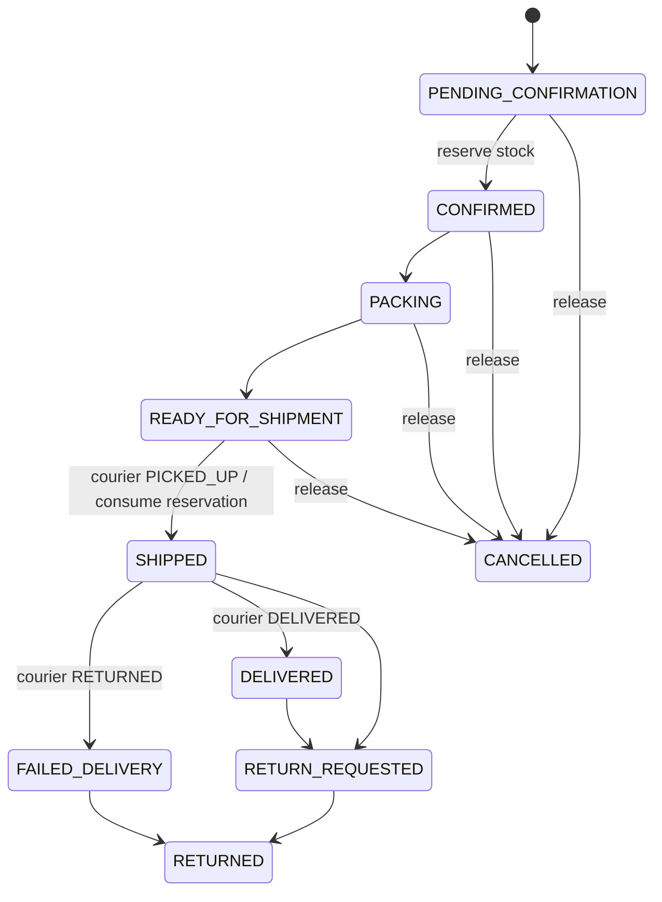

# Architecture

RetailOps BD has four parts:

- a React PWA client,
- a thin FastAPI HTTP layer,
- Python domain services,
- PostgreSQL, with Redis and Celery for background work.

The server is authoritative. Offline client state is optimistic until the server reconciles it.

## Rules the code enforces

| Rule | Where |
| --- | --- |
| Routes stay thin. Permissions are checked on the server with `require_permission` | [app/api/deps.py](../backend/app/api/deps.py), [app/core/permissions.py](../backend/app/core/permissions.py) |
| Every query filters on `organization_id`. Branch-level data also filters on `branch_id` | all services |
| Stock changes only through `InventoryService.apply_movement`, which locks the balance row (`FOR UPDATE`) and writes a ledger movement in the same transaction | [inventory_service.py](../backend/app/services/inventory_service.py) |
| Money is `Decimal` / `NUMERIC(14,2)` | models, schemas |
| Timestamps are stored in UTC. Business days and report ranges use Dhaka time (UTC+6) | [app/utils/time.py](../backend/app/utils/time.py) |
| Offline writes are idempotent on `client_transaction_id` | [sales_service.py](../backend/app/services/sales_service.py), [sync_service.py](../backend/app/services/sync_service.py) |
| Order status changes go through `LEGAL_TRANSITIONS`, never through the client | [order_service.py](../backend/app/services/order_service.py) |
| Order logic never sees courier payloads, only `CourierStatus` | [couriers.py](../backend/app/services/couriers.py) |

## Inventory lifecycle

| Event | Physical | Reserved | Ledger movement |
| --- | --- | --- | --- |
| Adjustment / opening stock | ± | | `MANUAL_ADJUSTMENT` / `OPENING_STOCK` |
| Purchase received (exactly once) | + | | `PURCHASE_RECEIPT` |
| POS sale | − | | `SALE` (`OFFLINE_SYNC` when imported from a device) |
| Order confirmed | | + | — (an `inventory_reservations` row) |
| Order cancelled before shipping | | − | — (reservation released) |
| Order shipped (courier pickup) | − | − | `ORDER_FULFILLMENT` |
| Return: sellable / damaged / missing | + / 0 / 0 | | `RETURN_SELLABLE` / `RETURN_DAMAGED` / `RETURN_MISSING` |

Available stock is `physical − reserved`. An offline oversell may push physical stock below zero. In that case the server records a `sync_conflicts` row rather than rejecting a sale that has already been paid.

## Order and courier flow

## Background jobs

Celery beat runs inside the single worker process:

| Task | Schedule | Purpose |
| --- | --- | --- |
| `inventory.low_stock_alerts` | 15 min | one unread `LOW_STOCK` notification per variant at or below its reorder level |
| `sync.release_stale_transactions` | 5 min | `sync_transactions` stuck in `SYNCING` for more than 15 min become `FAILED`, so device retries can proceed |

Every task opens its own engine with `NullPool`, because each Celery task runs in a fresh event loop.

## Frontend

- **Data:** TanStack Query for server state and Zustand for client state (auth, cart, sync status).
- **Offline:** Dexie (IndexedDB) holds the catalog cache and the sale queue.
- **Code splitting:** routes are code-split. POS and Sync Center ship in the entry bundle so they work offline before ever being visited online.
- **Service worker:** [frontend/public/sw.js](../frontend/public/sw.js) uses network-first caching for the app shell and never caches `/api`.
