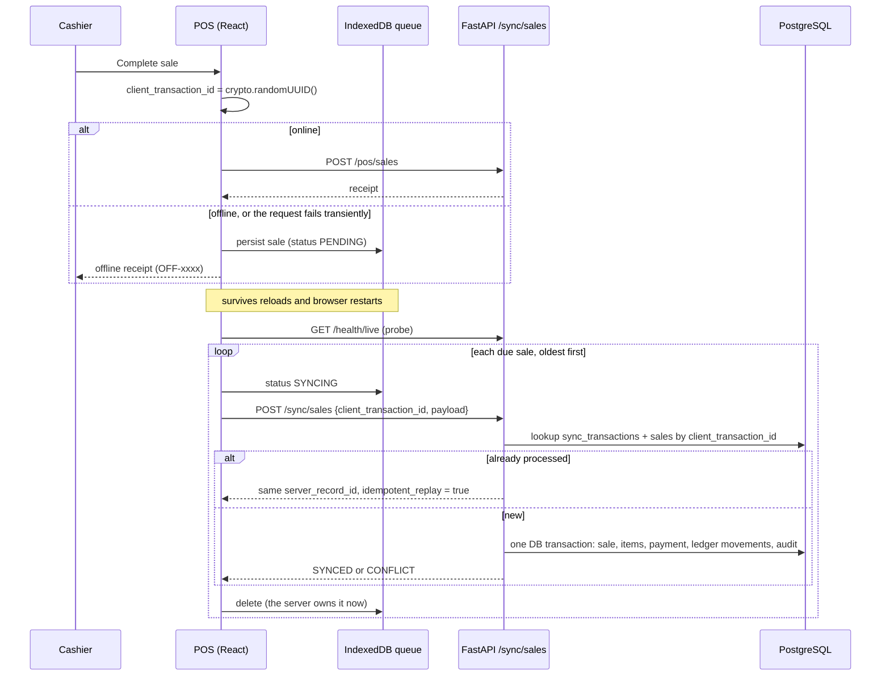

# Offline synchronization

The POS keeps selling when the network or the API is unavailable. PostgreSQL stays authoritative: an offline sale is optimistic until the server acknowledges it **exactly once**.

## Product catalog on the device

The POS never searches over the network (plan §40). On opening, on reconnecting and every 5 minutes it:

1. calls `GET /sync/catalog-version`, a fingerprint of products, variants and categories;
2. downloads `GET /sync/catalog` only if the version changed, or if the cached catalog belongs to another organization;
3. otherwise refreshes just `GET /sync/stock`, available quantity per variant.

The catalog lives in IndexedDB (Dexie `catalog`, indexed by barcode, SKU and category). Search, category filters and barcode lookup all read it, so the POS sells the same way online and offline. Local reads use React Query's `networkMode: "always"`, because by default it pauses every query while the browser is offline.

## Write path

An online checkout that fails with a network error or a 5xx is queued under the **same** `client_transaction_id`. If the server had already committed the sale and only the response was lost, the later sync returns the original sale and creates no second one.

## Idempotency contract

- Every offline write carries a client-generated UUID `client_transaction_id`.
- Two unique constraints enforce it: `sales (organization_id, client_transaction_id)` and `sync_transactions (organization_id, client_transaction_id)`.
- Replays return the original `server_record_id`.

The behavior is covered by tests:

- `test_offline_sale_synced_twice_creates_exactly_one_sale` asserts one sale, one payment and one ledger movement set.
- `test_catalog_inventory_sale_and_idempotency` covers the same guarantee for online POS.

## Client sync engine

Source: [frontend/src/lib/syncEngine.ts](../frontend/src/lib/syncEngine.ts).

| Rule | Behavior |
| --- | --- |
| Trigger | the `online` event, app start, every 15 s, and "Sync now" in the Sync Center |
| Lock | one in-memory lock per tab. Parallel tabs are safe because the server is idempotent |
| Probe | `GET /health/live` with a 4 s timeout before sending anything. If it fails, the status is `OFFLINE` and nothing is sent |
| Order | creation order. A sale that is backing off holds back every later sale |
| Transient failure | network errors, 5xx, 401, 408, 425 and 429 mark the sale `FAILED` with exponential backoff (5 s → 10 s → … capped at 5 min) and stop the run |
| Permanent failure | any other 4xx marks the sale `REJECTED`, which shows as "Needs review" in the Sync Center. The queue continues, and the sale is never retried automatically |
| Interrupted run | rows left in `SYNCING` by a closed tab are picked up again, which is safe because of idempotency |

The server also releases its own stuck rows: the Celery beat job `sync.release_stale_transactions` marks `sync_transactions` that have been `SYNCING` for more than 15 minutes as `FAILED`, so the device's retry can reprocess them.

## An offline sale keeps its own facts

Each queued sale carries the price paid per line (`unit_price`) and the moment it happened (`offline_created_at`). When the server imports it ([`SalesService.create_offline`](../backend/app/services/sales_service.py)):

- it records the sale at its original time, so it counts toward the right business day. A device clock that runs ahead is clamped to the server's time plus five minutes;
- it charges the prices the customer actually paid, even if the catalog changed since;
- it accepts a variant that was deactivated after the sale;
- it still checks totals, discount and payment, and a malformed sale is rejected as a permanent error.

`synced_at` records when the server received the sale.

## Conflicts

The server never rejects or deletes a completed offline sale because the world moved on, since money has already changed hands. It imports the sale and records a `sync_conflicts` row for manager review instead:

| Type | When | Details |
| --- | --- | --- |
| `INVENTORY_OVERSELL` | The ledger movement took physical stock below zero. Example: POS A sold 3 offline while POS B sold the last 4 | per line: SKU, quantity sold, stock before and after |
| `PRICE_MISMATCH` | A line's paid price differs from the current catalog price | per line: SKU, paid price, catalog price |

Each conflict also raises an in-app `SYNC_CONFLICT` notification and appears in the Sync Center.

Tests:

- `test_offline_oversell_keeps_sale_and_raises_conflict`
- `test_oversell_conflict_names_the_lines`
- `test_offline_sale_keeps_its_time_and_paid_price`
- `test_offline_sale_of_a_since_deactivated_variant_is_imported`

## Offline sign-in

The signed-in user, never a token, is cached locally. After an offline reload the POS opens from that cache. A network failure during token refresh keeps the cached session, and only an explicit 401 from the server signs the user out. Token refresh is single-flight, because refresh tokens rotate and parallel refreshes would invalidate each other.

The service worker never caches `/api/*` or `/health/*`, so the connectivity probe always reflects the real server.

## Reconciliation

After a successful run the device holds no unsynced movements for acknowledged sales, so displayed stock is the server's canonical snapshot. Sales still waiting in the queue are the only local deltas.
