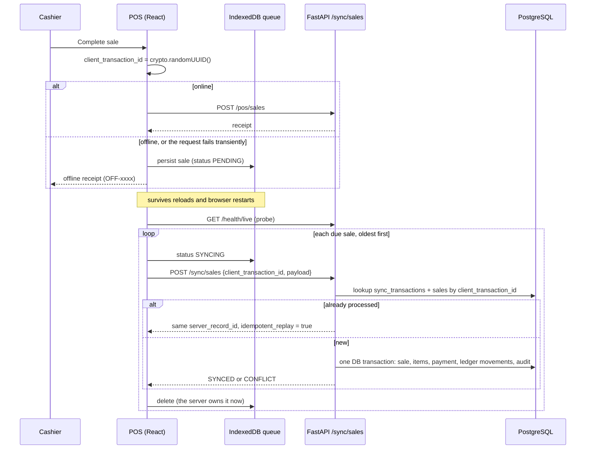

# Offline synchronization

The POS keeps selling when the network or the API is unavailable. PostgreSQL stays authoritative: an offline sale is optimistic until the server acknowledges it **exactly once**.

## Write path

An online checkout that fails with a network error or a 5xx is queued under the **same** `client_transaction_id`. If the server had already committed the sale and only the response was lost, the later sync returns the original sale and creates no second one.

## Idempotency contract

- Every offline write carries a client-generated UUID `client_transaction_id`.
- Two unique constraints enforce it: `sales (organization_id, client_transaction_id)` and `sync_transactions (organization_id, client_transaction_id)`.
- Replays return the original `server_record_id`.

The behavior is covered by tests:

- `test_offline_sale_synced_twice_creates_exactly_one_sale` asserts one sale, one payment and one ledger movement set.
- `test_catalog_inventory_sale_and_idempotency` covers the same guarantee for online POS.

## Client sync engine

Source: [frontend/src/lib/syncEngine.ts](../frontend/src/lib/syncEngine.ts).

| Rule | Behavior |
| --- | --- |
| Trigger | the `online` event, app start, every 15 s, and "Sync now" in the Sync Center |
| Lock | one in-memory lock per tab. Parallel tabs are safe because the server is idempotent |
| Probe | `GET /health/live` with a 4 s timeout before sending anything. If it fails, the status is `OFFLINE` and nothing is sent |
| Order | creation order. A sale that is backing off holds back every later sale |
| Transient failure | network errors, 5xx, 401, 408, 425 and 429 mark the sale `FAILED` with exponential backoff (5 s → 10 s → … capped at 5 min) and stop the run |
| Permanent failure | any other 4xx marks the sale `REJECTED`, which shows as "Needs review" in the Sync Center. The queue continues, and the sale is never retried automatically |
| Interrupted run | rows left in `SYNCING` by a closed tab are picked up again, which is safe because of idempotency |

The server also releases its own stuck rows: the Celery beat job `sync.release_stale_transactions` marks `sync_transactions` that have been `SYNCING` for more than 15 minutes as `FAILED`, so the device's retry can reprocess them.

## Conflicts

Example: offline POS A sells 3 units while online POS B sells the last 4.

The server does **not** reject or delete the offline sale. Money has already changed hands. Instead it:

1. imports the sale and its payment,
2. applies the ledger movement, which may take stock negative,
3. records a `sync_conflicts` row of type `INVENTORY_OVERSELL`,
4. raises an in-app `SYNC_CONFLICT` notification,
5. lists the conflict in the Sync Center for manager review.

This behavior is covered by `test_offline_oversell_keeps_sale_and_raises_conflict`.

## Reconciliation

After a successful run the device holds no unsynced movements for acknowledged sales, so displayed stock is the server's canonical snapshot. Sales still waiting in the queue are the only local deltas.
