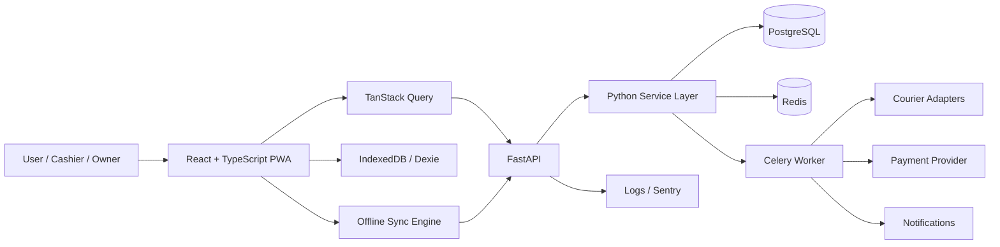

# RetailOps BD — Full Implementation Plan

> **Product:** RetailOps BD  
> **Positioning:** Production-oriented offline-first POS, inventory, order, COD, courier, returns, and analytics platform for Bangladesh-focused SMEs  
> **Portfolio goal:** Demonstrate serious Python backend engineering, full-stack product design, offline-first architecture, real business workflows, testing, deployment, and polished UI/UX  
> **Tagline:** **Sell anywhere. Track everything. Keep working offline.**

---

# 0. How to Use This Plan

This document is the implementation source of truth for RetailOps BD.

Build the project in vertical slices. Every major session should end with:

1. working code,
2. tests,
3. a meaningful Git commit,
4. no broken previously-completed workflow,
5. a visible piece of the product that can be demoed.

Do **not** build every database model first and then every API and then every screen. Build complete workflows from UI → API → database → tests.

The first two complete vertical slices are:

```text
Login
→ Create Product
→ Add Inventory
→ Open POS
→ Scan/Search Product
→ Complete Sale
→ Inventory Decreases
→ Print Receipt
→ Dashboard Updates
```

then:

```text
Load Product Catalog
→ Go Offline
→ Create POS Sale
→ Store Locally
→ Print Receipt Offline
→ Reconnect
→ Sync Exactly Once
→ Reconcile Inventory
→ Show Sync Result
```

If these two flows are excellent, the project already demonstrates much more engineering depth than a generic CRUD portfolio app.

---

# 1. Product Vision

RetailOps BD is a responsive, installable retail operations web application for Bangladeshi SMEs.

It unifies:

- physical POS sales,
- Facebook/phone/manual orders,
- product variants,
- inventory and stock movements,
- customers,
- Bangladesh phone-number handling,
- cash and mobile financial service payments,
- COD risk assessment,
- courier fulfillment,
- returns and RTO,
- purchases and suppliers,
- analytics,
- audit logs,
- offline sales,
- synchronization and conflict reconciliation.

The application should feel like a real commercial product, not a university assignment.

## Core product promise

> A shop should still be able to sell products, print a receipt, and track the sale when the internet goes down. When connectivity returns, RetailOps BD synchronizes safely and reconciles inventory without creating duplicate transactions.

---

# 2. Product Principles

## 2.1 Python-first engineering

Python should own most business logic:

- FastAPI API layer
- authentication and authorization
- product/inventory logic
- order state transitions
- COD risk engine
- financial calculations
- courier adapters
- reconciliation logic
- background jobs
- reporting
- seed/demo scripts
- test fixtures
- future ML features

The frontend should remain React/TypeScript because the browser is responsible for:

- high-quality interactive UI,
- PWA behavior,
- IndexedDB,
- offline product cache,
- barcode keyboard input,
- Motion animations,
- responsive data-heavy screens.

This gives the project a strong **Python full-stack** identity without forcing Python into a browser role where React is substantially stronger.

## 2.2 Correctness before cleverness

Important data operations must be transactional.

Never sacrifice inventory correctness for a fancy abstraction.

## 2.3 Offline is a first-class state

Offline mode is not an error page.

The UI must deliberately support:

```text
ONLINE
OFFLINE
SYNCING
SYNCED
SYNC_FAILED
CONFLICT
```

## 2.4 The server is authoritative

The browser may maintain optimistic local state, but the server is the source of truth after reconciliation.

```text
Local optimistic state
        ↓
Synchronization
        ↓
Server validation
        ↓
Authoritative state
        ↓
Client reconciliation
```

## 2.5 Speed matters at the POS

Cashiers must be able to:

- scan,
- change quantity,
- select payment,
- complete the sale,
- print,
- continue to the next customer

with very few interactions.

## 2.6 Motion should communicate state

Animation is useful when it explains:

- where an item came from,
- where it moved,
- what changed,
- whether an action succeeded,
- whether the system is offline/syncing,
- which panel is active.

Avoid decorative animation that slows down work.

---

# 3. Final Technology Stack

## 3.1 Backend — primary focus

| Layer | Choice | Why |
|---|---|---|
| Language | Python | Primary portfolio language |
| Web API | FastAPI | Typed modern Python API, OpenAPI, async support |
| Validation | Pydantic | Request/response and domain validation |
| Settings | pydantic-settings | Structured environment configuration |
| ORM | SQLAlchemy 2.x | Production-grade relational modeling |
| Migrations | Alembic | Explicit schema migration history |
| Database | PostgreSQL | Transactions, constraints, indexes, JSONB when justified |
| Driver | psycopg | Modern PostgreSQL driver |
| Cache / queue broker | Redis | Caching, locks, background tasks |
| Worker | Celery | Recognizable production background worker |
| Authentication | JWT access + rotating refresh session | SPA-friendly auth |
| Password hashing | Argon2 | Modern password hashing |
| Rate limiting | Redis-backed limiter | Protect auth and expensive endpoints |
| HTTP clients | httpx | Courier/payment integrations |
| Logging | structlog or stdlib structured JSON logging | Searchable production logs |
| Testing | Pytest | Unit + integration tests |
| Factories | factory_boy or custom factories | Test data |
| Lint | Ruff | Fast linting/formatting |
| Type checking | Pyright or mypy | Better Python correctness |
| Package manager | uv | Fast dependency/environment management |

### Python version policy

Use a currently supported stable Python release that is supported by all chosen dependencies. Pin the exact production version in:

```text
.python-version
pyproject.toml
Dockerfile
CI
deployment configuration
```

Do not let local, CI, and production Python versions drift.

---

## 3.2 Frontend

| Layer | Choice |
|---|---|
| Framework | React |
| Language | TypeScript |
| Build | Vite |
| Styling | Tailwind CSS |
| Component foundation | shadcn/ui + Radix primitives |
| Animation | Motion for React |
| Router | React Router |
| Server state | TanStack Query |
| Small global client state | Zustand |
| Forms | React Hook Form |
| Validation | Zod |
| Offline DB | IndexedDB + Dexie |
| Charts | Recharts |
| Tables | TanStack Table |
| i18n | react-i18next |
| Icons | Lucide React |
| Dates | date-fns |
| Toasts | Sonner |
| PWA | vite-plugin-pwa |

### Why not a Python frontend framework?

Do not use Streamlit, Dash, NiceGUI, or Reflex for the main application.

They are useful for dashboards/prototypes, but this project needs:

- offline IndexedDB,
- PWA service workers,
- barcode-first interaction,
- highly controlled responsive layouts,
- rich Motion transitions,
- production-grade client state.

Keep the browser layer in React while making the backend/business layer heavily Python-oriented.

---

## 3.3 Infrastructure

- Docker
- Docker Compose
- GitHub Actions
- PostgreSQL
- Redis
- Render or Railway for API/worker
- Neon or managed PostgreSQL if preferred
- Sentry for errors
- optional object storage later for product images
- HTTPS everywhere in production

---

# 4. Architecture



## Architectural rule

Routes should be thin.

```text
FastAPI Router
↓
Service Layer
↓
Domain Rules / Transaction Boundary
↓
Repository / ORM
↓
PostgreSQL
```

Avoid this:

```python
@router.post("/sale")
def create_sale(...):
    # 200 lines of business logic here
```

Prefer:

```python
@router.post("/sales")
async def create_sale(
    command: CreateSaleRequest,
    service: SalesService = Depends(get_sales_service),
):
    return await service.create_sale(command)
```

---

# 5. Repository Structure

```text
retailops-bd/
│
├── backend/
│   ├── app/
│   │   ├── api/
│   │   │   ├── deps.py
│   │   │   └── v1/
│   │   │       ├── auth.py
│   │   │       ├── products.py
│   │   │       ├── inventory.py
│   │   │       ├── sales.py
│   │   │       ├── customers.py
│   │   │       ├── orders.py
│   │   │       ├── sync.py
│   │   │       ├── couriers.py
│   │   │       ├── returns.py
│   │   │       ├── purchases.py
│   │   │       ├── reports.py
│   │   │       └── audit.py
│   │   │
│   │   ├── core/
│   │   │   ├── config.py
│   │   │   ├── security.py
│   │   │   ├── database.py
│   │   │   ├── logging.py
│   │   │   ├── exceptions.py
│   │   │   └── permissions.py
│   │   │
│   │   ├── models/
│   │   ├── schemas/
│   │   ├── repositories/
│   │   ├── services/
│   │   │   ├── auth_service.py
│   │   │   ├── product_service.py
│   │   │   ├── inventory_service.py
│   │   │   ├── sales_service.py
│   │   │   ├── customer_service.py
│   │   │   ├── order_service.py
│   │   │   ├── risk_service.py
│   │   │   ├── return_service.py
│   │   │   ├── report_service.py
│   │   │   └── audit_service.py
│   │   │
│   │   ├── sync/
│   │   │   ├── idempotency.py
│   │   │   ├── validator.py
│   │   │   ├── processor.py
│   │   │   ├── reconciliation.py
│   │   │   └── conflicts.py
│   │   │
│   │   ├── integrations/
│   │   │   ├── courier/
│   │   │   │   ├── base.py
│   │   │   │   ├── mock.py
│   │   │   │   └── steadfast.py
│   │   │   └── payments/
│   │   │       ├── base.py
│   │   │       └── sslcommerz.py
│   │   │
│   │   ├── tasks/
│   │   ├── utils/
│   │   └── main.py
│   │
│   ├── alembic/
│   ├── scripts/
│   │   ├── seed_demo.py
│   │   └── create_admin.py
│   ├── tests/
│   │   ├── unit/
│   │   ├── integration/
│   │   └── factories/
│   ├── pyproject.toml
│   └── Dockerfile
│
├── frontend/
│   ├── src/
│   │   ├── app/
│   │   ├── routes/
│   │   ├── components/
│   │   │   ├── ui/
│   │   │   ├── layout/
│   │   │   ├── motion/
│   │   │   └── data-display/
│   │   ├── features/
│   │   │   ├── auth/
│   │   │   ├── dashboard/
│   │   │   ├── pos/
│   │   │   ├── products/
│   │   │   ├── inventory/
│   │   │   ├── orders/
│   │   │   ├── customers/
│   │   │   ├── courier/
│   │   │   ├── returns/
│   │   │   ├── reports/
│   │   │   └── sync/
│   │   ├── db/
│   │   │   ├── dexie.ts
│   │   │   ├── schema.ts
│   │   │   └── migrations.ts
│   │   ├── lib/
│   │   ├── hooks/
│   │   ├── stores/
│   │   ├── services/
│   │   ├── styles/
│   │   ├── i18n/
│   │   └── main.tsx
│   ├── public/
│   ├── e2e/
│   ├── package.json
│   └── Dockerfile
│
├── docs/
│   ├── architecture.md
│   ├── database.md
│   ├── api.md
│   ├── offline-sync.md
│   ├── design-system.md
│   └── deployment.md
│
├── .github/workflows/
├── docker-compose.yml
├── .env.example
├── Makefile
├── README.md
└── plan.md
```

---

# 6. UI/UX Direction

## 6.1 Visual personality

RetailOps BD should feel:

- fast,
- clean,
- calm,
- trustworthy,
- premium but practical,
- dense enough for real operations,
- not visually noisy.

Reference feeling:

```text
Linear / Stripe-style clarity
+
modern SaaS analytics
+
Motion-quality transitions
+
a very fast retail POS
```

Do not imitate Motion.dev visually page-for-page.

Use Motion.dev as a reference for **interaction quality**:
- smooth spatial transitions,
- restrained spring physics,
- crisp entrance/exit animations,
- tactile controls,
- continuity between interface states.

---

# 7. Design System

## 7.1 Color direction

Use semantic design tokens, not random colors inside components.

Suggested base:

```css
--background
--surface
--surface-elevated
--border
--text
--text-muted

--brand
--brand-foreground

--success
--warning
--danger
--info
```

Recommended visual direction:

- neutral/slate surfaces,
- bright emerald/teal brand accent,
- amber warnings,
- red destructive/error states,
- blue informational states.

Support dark mode after the light mode is stable.

## 7.2 Typography

Recommended:

```text
English UI: Inter
Bangla UI: Noto Sans Bengali
Monospace data / IDs: JetBrains Mono or system monospace
```

Hierarchy:

```text
Display       32–40
Page title    24–30
Section       18–20
Body          14–16
Compact data  12–14
```

Use tabular numerals for monetary and metric values where supported.

## 7.3 Radius

Use a consistent radius scale.

```text
small controls: 8px
cards: 12px
large panels/dialogs: 16px
pill/status: 999px
```

## 7.4 Spacing

Use a 4px base grid.

Common values:

```text
4 / 8 / 12 / 16 / 20 / 24 / 32 / 40 / 48
```

## 7.5 Shadows

Shadows should be subtle.

Use borders more often than heavy shadows.

## 7.6 Icons

Use one icon set only.

Recommended:

```text
lucide-react
```

---

# 8. Motion Design System

Install:

```bash
npm install motion
```

Import from:

```ts
import { motion, AnimatePresence } from "motion/react"
```

## 8.1 Motion rules

### Rule 1 — fast interactions

Buttons and controls:

```text
100–160ms
```

Panels and route-level transitions:

```text
180–280ms
```

Avoid sluggish 500ms UI transitions.

### Rule 2 — use springs for spatial movement

Use springs for:

- cart item insertion/reordering,
- drawer movement,
- shared tab indicators,
- expanding product details,
- draggable/mobile interactions.

### Rule 3 — opacity + transform

Prefer performant properties:

```text
opacity
transform
scale
translate
```

### Rule 4 — no animation for everything

Tables should not have every cell flying into view.

Only animate meaningful structure.

### Rule 5 — respect reduced motion

Every animation abstraction must support:

```text
prefers-reduced-motion
```

Use Motion's reduced-motion facilities or CSS equivalents.

---

# 9. Motion Patterns to Use

## 9.1 Shared active navigation indicator

Use `layoutId` for the current sidebar/bottom-nav highlight.

Effect:

```text
Dashboard → Products → Inventory
```

The selected indicator glides to the next item rather than disappearing/reappearing.

## 9.2 Animated dashboard cards

On initial page load:

```text
opacity: 0 → 1
y: 8 → 0
```

Small stagger only.

Do not replay constantly.

## 9.3 POS cart

When a product is scanned:

```text
product card
→ subtle tap reaction
→ item enters cart
→ cart total animates
```

Use layout animation on cart rows so quantity/insert/delete movements remain spatially understandable.

## 9.4 Order drawer

Clicking an order row opens a side detail panel.

Use:

```text
AnimatePresence
```

for panel entrance/exit.

Desktop:
- right sheet

Mobile:
- bottom sheet / full-screen detail

## 9.5 Shared product image

Optional polish:

```text
Product list card image
→ Product detail hero
```

using `layoutId`.

## 9.6 Sync state

The sync badge should visually transition:

```text
Online
→ Offline
→ 2 pending
→ Syncing
→ Synced
```

Do not use aggressive pulsing.

A subtle rotating icon while syncing is enough.

## 9.7 Toasts

Use brief slide/fade transitions.

Success toast:
- sale complete
- inventory updated
- sync successful

Error toast:
- network request failed
- validation failed

Persistent high-severity issue:
- do not rely on toast only
- show in-page alert or Sync Center

## 9.8 Number transitions

For dashboard metrics, animate a number only when it genuinely changes.

Do not animate every render.

## 9.9 Skeleton transitions

Use skeletons for loading data, then crossfade into content.

Avoid full-page spinners.

---

# 10. App Shell

## Desktop

```text
┌───────────────────────────────────────────────────────────┐
│ Sidebar │ Top bar: Search     Branch     Sync    Profile   │
│         ├─────────────────────────────────────────────────┤
│ Logo    │                                                 │
│         │                  ROUTE CONTENT                   │
│ Dash    │                                                 │
│ POS     │                                                 │
│ Orders  │                                                 │
│ Product │                                                 │
│ Stock   │                                                 │
│ People  │                                                 │
│ Reports │                                                 │
│         │                                                 │
│ Settings│                                                 │
└───────────────────────────────────────────────────────────┘
```

Sidebar can collapse to icons.

Persist state locally.

## Tablet

- compact sidebar or navigation rail
- POS becomes two-column when possible

## Mobile

Use bottom navigation for top tasks:

```text
Home
Orders
POS
Stock
More
```

The POS button may be visually emphasized.

---

# 11. Global Command/Search Experience

Add a keyboard-accessible command palette.

Shortcut:

```text
Ctrl/Cmd + K
```

Search:

- product,
- barcode,
- order number,
- customer phone,
- invoice,
- shipment tracking number.

Actions:

- New sale
- New order
- Add product
- Adjust stock
- Open Sync Center

This makes the application feel significantly more polished.

---

# 12. Dashboard UX

## Desktop layout

Top:
- greeting / date context
- branch selector
- date-range selector
- sync state

Metric cards:

- Revenue
- Orders
- Gross profit
- Average order value
- Pending orders
- Low stock

Main charts:

- Revenue trend
- Orders by source

Secondary:

- Top products
- Low-stock list
- Recent orders
- Courier success

## Mobile

Do not compress desktop charts into tiny cards.

Prioritize:

1. revenue,
2. orders,
3. low stock,
4. pending confirmation,
5. recent activity.

Charts can scroll horizontally or switch to concise summaries.

## Motion

- metric cards: subtle entrance
- chart: mild opacity/clip reveal
- date range changes: crossfade/update, no huge transitions
- selected timeframe: shared layout indicator

---

# 13. POS UX — Flagship Screen

POS is a workspace, not a normal CRUD screen.

## Desktop layout

```text
┌───────────────────────────────────────────────────────────────┐
│ POS   [ Scan barcode or search product... ]  ONLINE  POS-01  │
├───────────────────────────────────────┬───────────────────────┤
│ categories                            │ CART                  │
│ [All] [Fashion] [Shoes] [Electronics]│                       │
│                                       │ Product A        ৳800 │
│ product grid                          │        −  2  +         │
│                                       │ Product B       ৳1200 │
│ ┌────────┐ ┌────────┐ ┌────────┐      │        −  1  +         │
│ │product │ │product │ │product │      │                       │
│ └────────┘ └────────┘ └────────┘      │ Subtotal       2800   │
│                                       │ Discount          0   │
│                                       │ Total          2800   │
│                                       │                       │
│                                       │ CASH BKASH NAGAD      │
│                                       │ [ COMPLETE SALE ]     │
└───────────────────────────────────────┴───────────────────────┘
```

## POS interaction requirements

- barcode input always available,
- scanner works like keyboard input,
- Enter finalizes barcode,
- exact match adds item immediately,
- duplicate scan increments quantity,
- product search is local-first,
- keyboard controls where useful,
- large touch targets,
- cart always visible on desktop,
- totals never hidden below long product lists.

## Useful shortcuts

```text
F2       focus product search
F4       customer
F6       discount
F8       payment
F9       complete sale
Esc      close current dialog
```

Document shortcuts inside the app.

## Motion

On scan:

1. matching product gives a tiny scale acknowledgment,
2. cart row inserts with layout animation,
3. total transitions,
4. success feedback is immediate.

No confetti.

---

# 14. Checkout UX

Checkout should be a focused modal/sheet.

Steps:

```text
Customer optional
↓
Discount optional
↓
Payment method
↓
Amount received
↓
Change due
↓
Complete
```

Payment methods:

```text
Cash
bKash
Nagad
Card
Split
```

For V1, external payment verification is not necessary for manual MFS payments.

After success:

```text
✓ Sale complete
Invoice POS-2026-000234
Total ৳5,700

[Print Receipt]
[New Sale]
[View Sale]
```

`New Sale` should be the primary action.

---

# 15. Offline UX

The user must always understand connection state.

## Online

```text
● Online
Last synced just now
```

## Offline

```text
● Offline mode
2 transactions waiting to sync
```

## Syncing

```text
↻ Syncing 2 transactions…
```

## Error

```text
! Sync requires attention
1 failed • 1 conflict
[Open Sync Center]
```

## Rules

- do not block POS just because the API is unreachable,
- do not show scary full-screen error pages,
- indicate that local sales are safe,
- expose pending count,
- expose last successful sync,
- provide manual `Sync now`,
- show conflicts clearly.

---

# 16. Sync Center UX

Route:

```text
/sync
```

Header:

```text
Synchronization
Device POS-01
Last successful sync 8:45 PM
```

Cards:

```text
Pending
Syncing
Failed
Conflicts
```

Transaction table:

```text
Local ID
Type
Created
Retry count
Status
Server ID
Action
```

Conflict detail:

```text
Variant: SHOE-42
Local expected stock: 2
Server stock: 1
Sale quantity: 3

Result:
Inventory requires reconciliation.

[Review Inventory]
[Mark Reviewed]
```

---

# 17. Product Management UX

Product list supports:

- table/grid toggle,
- search,
- category,
- stock status,
- active/inactive,
- bulk selection later.

Columns:

```text
Product
SKU
Variants
Stock
Price
Category
Status
Actions
```

Quick create should not require navigating through five pages.

## Product form

Sections:

1. Basics
2. Pricing
3. Variants
4. Inventory defaults
5. Media
6. Advanced

Variant builder:

```text
Color: Black, White
Size: M, L, XL

→ generate combinations
```

Allow SKU/barcode editing per generated variant.

---

# 18. Inventory UX

Main inventory table:

```text
Variant
SKU
Physical
Reserved
Available
Reorder level
Stock status
```

Row action opens movement history.

## Stock adjustment

Require:

- quantity or new count,
- reason,
- note.

Never allow unexplained silent inventory edits.

Example:

```text
Current physical: 12
New physical: 20
Difference: +8

Reason:
Physical count correction

Note:
Counted during closing shift
```

---

# 19. Inventory Ledger

Every movement is immutable after creation.

Fields:

- id,
- organization_id,
- branch_id,
- variant_id,
- movement_type,
- quantity_delta,
- previous_quantity,
- new_quantity,
- reference_type,
- reference_id,
- created_by,
- created_at,
- note.

Movement types:

```text
PURCHASE
SALE
RETURN
CANCELLED_ORDER_RELEASE
MANUAL_ADJUSTMENT
DAMAGED
TRANSFER_IN
TRANSFER_OUT
OFFLINE_SYNC
```

Never rely only on a mutable `stock` number.

---

# 20. Orders UX

Order list should be operational.

Filters:

- status,
- source,
- date,
- courier,
- COD risk,
- payment,
- search.

Saved views later:

```text
Needs confirmation
Ready to pack
Ready for courier
Failed delivery
High COD risk
```

Order source badges:

```text
POS
FACEBOOK
INSTAGRAM
PHONE
WEBSITE
WHATSAPP
OTHER
```

---

# 21. Fast Facebook / Manual Order Form

Goal:

> a support agent can create a normal order in under one minute.

Layout:

```text
Customer phone
Customer name
Address
Area

Product search
Order items

Delivery area
Courier
Payment: COD

COD Risk

[Create Order]
```

Phone lookup should immediately retrieve an existing customer.

If the number is known:

```text
Rahim Ahmed
7 delivered
1 returned
LOW RISK
```

---

# 22. Customer UX

Customer profile:

Top:
- name,
- normalized phone,
- total spend,
- order count,
- delivery success,
- COD risk.

Tabs:

```text
Overview
Orders
Addresses
Payments
Returns
Activity
```

Use `layoutId` for the active tab indicator.

---

# 23. COD Risk Engine

V1 is deterministic Python business logic, not ML.

This is deliberate.

Example rules:

```text
+30 return ratio > 50%
+20 zero successful deliveries
+15 phone unverified
+15 duplicate order within 30 minutes
+10 incomplete address
+10 cancelled after shipment
-20 more than 5 successful deliveries
-10 repeat customer
```

Clamp:

```text
0–100
```

Levels:

```text
0–24     LOW
25–49    MEDIUM
50–74    HIGH
75–100   VERY_HIGH
```

Response should include **reasons**, not only a number.

Example API response:

```json
{
  "score": 65,
  "level": "HIGH",
  "reasons": [
    "3 previous returns",
    "No successful deliveries",
    "Phone is unverified"
  ],
  "recommendation": "Call customer before dispatch"
}
```

Future V3:
- scikit-learn / LightGBM risk model
- compare ML model against rule baseline
- explainability
- drift monitoring

Do not build this until real/synthetic historical data and the rest of the product are stable.

---

# 24. Order State Machine

Use explicit legal transitions.

```text
DRAFT
→ PENDING_CONFIRMATION
→ CONFIRMED
→ PACKING
→ READY_FOR_SHIPMENT
→ SHIPPED
→ DELIVERED
```

Alternative terminal paths:

```text
CANCELLED
RETURN_REQUESTED
RETURNED
FAILED_DELIVERY
```

Enforce transitions in Python service code.

Do not trust the frontend to decide valid state transitions.

---

# 25. Courier Architecture

Create an adapter interface.

```python
from typing import Protocol

class CourierProvider(Protocol):
    async def create_shipment(self, order): ...
    async def track_shipment(self, tracking_code: str): ...
    async def cancel_shipment(self, tracking_code: str): ...
```

Implement:

```text
MockCourierProvider
```

first.

Later:

```text
SteadfastProvider
PathaoProvider
RedXProvider
```

Do not couple order logic directly to any courier's JSON format.

Normalize external statuses into internal shipment statuses.

---

# 26. Returns UX

Return flow:

```text
Return received
↓
Inspect items
↓
Condition
├─ Sellable → stock +
├─ Damaged  → damaged movement
└─ Missing  → loss adjustment
```

Every returned item requires an explicit disposition.

---

# 27. Purchase and Supplier UX

Supplier:
- contact details,
- purchase history,
- supplied products,
- amount due later.

Purchase flow:

```text
Draft Purchase
→ Add Supplier
→ Add Items
→ Expected Date
→ Mark Received
→ Create Inventory Movements
→ Update Cost
```

Partial receiving can be V2.

---

# 28. Database Model

Core tables:

```text
organizations
branches

users
roles
permissions
role_permissions
user_roles
refresh_sessions

categories
products
product_variants
product_images

inventory_balances
inventory_movements
inventory_reservations

customers
customer_addresses

orders
order_items
order_status_events

sales
sale_items

payments

suppliers
purchases
purchase_items

shipments
shipment_events

returns
return_items

devices
sync_transactions
sync_conflicts

notifications
audit_logs
```

---

# 29. Important Database Constraints

Examples:

```text
products:
UNIQUE(organization_id, sku)

product_variants:
UNIQUE(organization_id, sku)
UNIQUE(organization_id, barcode)

customers:
INDEX(organization_id, normalized_phone)

orders:
UNIQUE(organization_id, order_number)

sales:
UNIQUE(organization_id, invoice_number)

sync_transactions:
UNIQUE(organization_id, client_transaction_id)
```

Every business-owned table should be designed with `organization_id` even if V1 only has one demo organization.

---

# 30. Money Handling

Do not use Python float for money.

Use:

```python
Decimal
```

Database:

```text
NUMERIC / DECIMAL
```

Define one money quantization policy.

For BDT:

```text
2 decimal places
```

even if most retail prices are whole taka.

---

# 31. Time Handling

Store timestamps in UTC.

Return timezone-aware timestamps.

Frontend displays:

```text
Asia/Dhaka
```

Never store naive datetimes for business events.

---

# 32. Bangladesh Phone Normalization

Create a dedicated Python utility/service.

Inputs:

```text
01712345678
+8801712345678
8801712345678
```

Canonical output:

```text
+8801712345678
```

Validate known mobile number patterns without hard-coding assumptions everywhere.

Use normalized phone for:
- customer lookup,
- duplicate detection,
- COD history,
- search.

---

# 33. Authentication

Recommended architecture:

```text
short-lived access token
+
rotating refresh session
```

Prefer refresh token in an HttpOnly Secure cookie if deployment architecture supports it.

Access token contains:

```text
sub
organization_id
role/permissions
session_id
```

Server remains authoritative for sensitive permission checks.

## Passwords

- Argon2
- minimum password policy
- never log passwords
- reset token is time-limited and one-time

## Session model

Persist refresh sessions:

```text
id
user_id
token_hash / family id
created_at
expires_at
revoked_at
device info
```

Allow logout-all-sessions later.

---

# 34. Authorization / RBAC

Roles:

```text
OWNER
MANAGER
CASHIER
SUPPORT
WAREHOUSE
```

Permissions should be explicit.

Examples:

```text
product:read
product:write
inventory:read
inventory:adjust
sale:create
sale:refund
order:confirm
order:cancel
shipment:create
report:read
staff:manage
settings:manage
```

Use FastAPI dependencies for permission checks.

Never hide a button on the frontend and call that "authorization".

---

# 35. API Conventions

Base:

```text
/api/v1
```

Response conventions:

- consistent pagination,
- structured validation errors,
- machine-readable error codes,
- request ID in production,
- ISO timestamps,
- Decimal serialized consistently.

Example error:

```json
{
  "error": {
    "code": "INSUFFICIENT_STOCK",
    "message": "Available stock is 2 but quantity 3 was requested",
    "details": {
      "variant_id": "..."
    }
  }
}
```

---

# 36. Primary API Surface

## Auth

```text
POST /auth/login
POST /auth/refresh
POST /auth/logout
GET  /auth/me
POST /auth/forgot-password
POST /auth/reset-password
```

## Products

```text
GET    /products
POST   /products
GET    /products/{id}
PATCH  /products/{id}
DELETE /products/{id}
GET    /products/{id}/variants
POST   /products/{id}/variants
GET    /products/barcode/{barcode}
```

## Inventory

```text
GET  /inventory
GET  /inventory/{variant_id}
POST /inventory/adjustments
GET  /inventory/movements
GET  /inventory/low-stock
```

## POS

```text
POST /pos/sales
GET  /pos/sales
GET  /pos/sales/{id}
POST /pos/sales/{id}/refund
```

## Customers

```text
GET    /customers
POST   /customers
GET    /customers/{id}
PATCH  /customers/{id}
GET    /customers/{id}/orders
GET    /customers/{id}/risk
```

## Orders

```text
GET  /orders
POST /orders
GET  /orders/{id}
PATCH /orders/{id}
POST /orders/{id}/confirm
POST /orders/{id}/cancel
POST /orders/{id}/pack
```

## Shipments

```text
POST /orders/{id}/shipment
GET  /shipments/{id}
POST /shipments/{id}/refresh
POST /shipments/{id}/cancel
```

## Sync

```text
POST /sync/batch
POST /sync/sales
GET  /sync/status/{client_transaction_id}
GET  /sync/catalog-version
GET  /sync/catalog
```

## Reports

```text
GET /reports/dashboard
GET /reports/sales
GET /reports/profit
GET /reports/inventory
GET /reports/products
GET /reports/customers
GET /reports/couriers
GET /reports/cod
```

---

# 37. POS Transaction Safety

Creating a sale must be atomic.

```text
BEGIN

Validate sale
Lock/read inventory as required
Create sale
Create sale items
Create payment
Create inventory movements
Update inventory balances
Create audit event

COMMIT
```

If any operation fails:

```text
ROLLBACK
```

There must never be a sale with missing inventory movements because an exception happened midway.

---

# 38. Inventory Reservation

For confirmed non-POS orders:

```text
physical_stock = 20
reserved_stock = 4
available_stock = 16
```

Formula:

```text
available_stock = physical_stock - reserved_stock
```

Lifecycle:

```text
PENDING_CONFIRMATION
→ no reservation

CONFIRMED
→ reserve

CANCELLED before fulfillment
→ release reservation

SHIPPED
→ consume reservation / apply sale movement according to chosen accounting flow
```

Define this behavior explicitly in tests.

---

# 39. Offline Local Database

Dexie schema:

```text
products
variants
customers_cache
offline_sales
offline_sale_items
sync_queue
catalog_meta
settings
```

Each local sale has:

```text
local_id
client_transaction_id
device_id
branch_id
cashier_id
created_at
payment_method
subtotal
discount
total
sync_status
server_sale_id nullable
```

Sync queue record:

```text
id
transaction_type
client_transaction_id
payload
created_at
retry_count
last_retry_at
status
last_error
```

Status:

```text
PENDING
SYNCING
SYNCED
FAILED
CONFLICT
```

---

# 40. Offline Product Cache

Online initialization:

```text
login
↓
fetch catalog version
↓
compare local version
↓
download changes/full catalog
↓
persist IndexedDB
↓
POS reads local database
```

Even while online, POS search should normally read the local catalog for speed.

The API is used to refresh/reconcile, not to search the network on every keystroke.

---

# 41. Network Detection

Use both:

```text
browser online/offline event
```

and:

```text
GET /api/health
```

Reason:

```text
Wi-Fi connected != backend reachable
```

Represent application connectivity with a state machine instead of a boolean where possible.

---

# 42. Offline Sale Flow

```text
Scan Product
↓
Read local IndexedDB product
↓
Add to cart
↓
Complete sale
↓
Generate UUID
↓
Persist local sale + items
↓
Update local optimistic stock
↓
Write sync queue record
↓
Generate local receipt
↓
Show success
```

The sale is considered locally completed before the internet returns.

---

# 43. Synchronization Algorithm

```text
Connectivity restored
↓
Health check succeeds
↓
Acquire local sync lock
↓
Fetch PENDING/FAILED-retryable records
↓
Order queue deterministically
↓
Mark current item SYNCING
↓
POST transaction
↓
Server checks client_transaction_id
↓
Server validates payload
↓
Server processes in DB transaction
↓
Server returns canonical record
↓
Mark local record SYNCED
↓
Store server ID
↓
Refresh affected inventory snapshot
↓
Continue
```

Use exponential backoff for transient failures.

Do not retry validation errors forever.

---

# 44. Idempotency

This is non-negotiable.

Every offline write gets:

```text
client_transaction_id = UUID
```

Server enforces uniqueness.

Scenario:

```text
Client sends sale
Server commits it
Connection dies before response
Client retries
```

Expected result:

```text
same original sale returned
no duplicate sale
no second stock deduction
```

This must have an integration test.

---

# 45. Conflict Strategy

Example:

```text
Server stock at 2:00 PM = 5

POS A offline sells 3
POS B online sells 4

POS A reconnects
```

Do not erase the real sale.

V1 strategy:

1. import the offline sale,
2. preserve financial transaction,
3. generate inventory conflict,
4. reconcile resulting inventory,
5. alert manager,
6. require review.

This better represents real retail behavior than silently deleting completed sales.

---

# 46. Reconciliation

After sync:

```text
Server canonical stock snapshot
↓
Frontend stores snapshot
↓
Any still-unsynced local movements retained
↓
Displayed stock recalculated
```

Conceptually:

```text
displayed_stock
=
server_stock
- local_unsynced_sales
+ local_unsynced_returns
```

The exact implementation must avoid applying the same movement twice.

---

# 47. Receipts

Support:

- 80mm thermal print CSS,
- browser print,
- reprint,
- optional PDF export.

Receipt:

```text
RetailOps Demo Store
Dhanmondi, Dhaka

Invoice: POS-2026-000234
Date: 08 Oct 2026
Cashier: Abrar

--------------------------------
T-Shirt Black L     2 x ৳1,200
Sneaker 42          1 x ৳3,500
--------------------------------
Subtotal                ৳5,900
Discount                  ৳200
Total                   ৳5,700

Payment: bKash

Thank you!
```

Print layout should not include sidebar/navigation.

---

# 48. Reports and Analytics

## Dashboard report endpoint

Prefer one aggregated endpoint for initial dashboard data rather than 12 individual requests.

Example:

```text
GET /reports/dashboard?from=&to=&branch_id=
```

Return:

- KPIs,
- revenue series,
- orders by source,
- top products,
- low stock,
- recent activity.

## Sales report

- date range,
- revenue,
- order count,
- discounts,
- refunds,
- AOV.

## Product report

- units,
- revenue,
- cost,
- gross profit,
- margin.

## Inventory

- physical,
- reserved,
- available,
- stock value,
- low stock,
- dead stock later.

## COD

- total COD,
- collected,
- pending,
- failed,
- return loss.

---

# 49. Profit Calculations

Core:

```text
Gross Profit
=
Revenue
- Cost of Goods Sold
```

Later:

```text
Contribution
=
Revenue
- Product Cost
- Delivery Expense
- Gateway Fee
- Discount
- Return Cost
```

Do not label contribution as accounting net profit.

Be precise in terminology.

---

# 50. Audit Logging

Log security/business-sensitive actions:

- login/logout where appropriate,
- product changes,
- stock adjustments,
- sale refunds,
- order cancellation,
- status overrides,
- user/role changes,
- settings changes,
- sync conflict resolution.

Fields:

```text
organization_id
user_id
action
entity_type
entity_id
old_data
new_data
created_at
request_id
ip
device/user_agent
```

Do not store secrets inside snapshots.

---

# 51. Background Jobs

Use Celery + Redis for:

- shipment tracking refresh,
- email later,
- payment reconciliation,
- generated reports,
- low-stock alert generation,
- stale sync housekeeping,
- periodic analytics precomputation later.

Do **not** push simple request/response tasks into Celery unnecessarily.

---

# 52. Notification Center

V1 in-app notifications:

- low stock,
- inventory conflict,
- failed sync,
- high-risk order,
- returned shipment,
- payment failure.

Bell menu:

```text
Unread count
→ latest items
→ mark read
→ View all
```

Critical sync problems also appear in Sync Center, not only notifications.

---

# 53. Search Strategy

V1:
- PostgreSQL indexes,
- `ILIKE` where acceptable,
- normalized search values,
- exact barcode/SKU lookup.

Possible V2:
- PostgreSQL trigram search.

Do not introduce Elasticsearch.

---

# 54. Pagination

All large list APIs should support:

```text
page / page_size
```

or cursor pagination if justified.

For V1 admin tables, offset pagination is acceptable.

Return:

```json
{
  "items": [],
  "page": 1,
  "page_size": 25,
  "total": 180
}
```

---

# 55. Frontend Data Strategy

Use:

```text
TanStack Query
```

for server state.

Use:

```text
Zustand
```

only for real client state such as:

- POS cart,
- UI shell preferences,
- temporary checkout state,
- connectivity/sync state.

Do not duplicate API data into Zustand just because it is globally accessible.

Offline catalog lives in Dexie.

---

# 56. Forms

Use:

```text
React Hook Form + Zod
```

UX:

- validate client-side for immediacy,
- server validates again,
- map server errors to fields,
- preserve form values after ordinary API errors,
- focus first invalid field.

---

# 57. Loading / Empty / Error States

Every major page must define:

```text
Loading
Empty
Success
Partial data
Recoverable error
Permission denied
Offline
```

Examples:

Products empty:
> Add your first product to start tracking inventory.

Orders empty:
> No orders match these filters.

Inventory error:
> Inventory could not be loaded. Your POS cache is unaffected.

---

# 58. Responsive Tables

Desktop:
- full table.

Tablet:
- hide low-priority columns.

Mobile:
- use row cards or expandable compact rows.

Do not create horizontally unusable 12-column tables on phones.

---

# 59. Accessibility

Required:

- semantic HTML,
- visible focus ring,
- keyboard operation,
- dialogs with focus trap,
- accessible labels,
- color is never the only status indicator,
- reduced motion,
- adequate contrast,
- touch target >= approximately 44px where practical.

Barcode/POS keyboard shortcuts must not make normal keyboard navigation impossible.

---

# 60. Internationalization

V1 should be structurally ready for:

```text
English
বাংলা
```

Use translation keys.

Never concatenate translated strings from fragments.

Amounts:

```text
৳5,700
```

Provide locale-aware number/date utilities.

---

# 61. PWA

Required V1 polish:

- manifest,
- icon set,
- install prompt where appropriate,
- cached application shell,
- cached POS static assets,
- offline fallback route,
- IndexedDB data persistence.

Do not depend on browser background sync for correctness. Treat it as an enhancement.

Main sync must work when the user reopens/focuses the app and connectivity is available.

---

# 62. Security Checklist

Backend:

- Argon2 password hashing
- rotating refresh sessions
- short access-token lifetime
- authorization on every protected endpoint
- tenant scoping
- Pydantic validation
- ORM parameterization
- rate limiting
- CORS allowlist
- secure cookies if used
- no stack traces in production responses
- secrets only in environment/secret manager
- dependency updates
- audit logging
- idempotency enforcement
- payment webhook verification
- upload validation later

Frontend:

- avoid localStorage for long-lived sensitive tokens if possible
- never render unsanitized HTML
- no secret API keys
- permission-aware UI
- clear logout
- session expiry handling

---

# 63. Observability

## Logging

Structured log event example:

```json
{
  "event": "sale.created",
  "sale_id": "...",
  "invoice": "POS-2026-000234",
  "organization_id": "...",
  "user_id": "...",
  "request_id": "..."
}
```

Do not log:
- passwords,
- refresh tokens,
- payment secrets.

## Error monitoring

Use Sentry in:
- backend,
- frontend.

## Health

```text
GET /health/live
GET /health/ready
```

Ready may verify required services.

---

# 64. Testing Pyramid

## Python unit tests

High priority:

- money calculation,
- COD risk,
- phone normalization,
- order transition rules,
- stock calculations,
- permission logic,
- reconciliation rules.

## Backend integration tests

Use real PostgreSQL in CI where practical.

Test:

```text
Create sale
→ payment row
→ inventory movement
→ balance updated
→ response
```

## API tests

- authentication,
- permissions,
- validation,
- pagination,
- errors.

## Frontend component tests

Focus on:
- POS cart,
- checkout,
- sync state,
- critical forms.

## E2E

Use Playwright.

---

# 65. Critical Offline Tests

## Test A — normal offline sale

```text
load catalog
→ offline
→ sale
→ receipt
→ pending queue
→ online
→ synced
→ server sale exists
→ stock reconciled
```

## Test B — retry after response loss

Simulate:

```text
server commits
response interrupted
client retries
```

Expected:

```text
one sale
one stock deduction
```

## Test C — conflict

```text
offline terminal oversells relative to server
```

Expected:
- sale retained,
- conflict created,
- manager alerted.

## Test D — reload while offline

```text
offline sale pending
→ close/reload browser
→ queue still present
→ reconnect
→ sync
```

This is important because IndexedDB persistence is the point of the architecture.

---

# 66. Performance Targets

Target:

```text
POS local barcode lookup      < 100 ms
POS local text search         < 200–300 ms
Normal API response           < 500 ms where practical
Dashboard meaningful content  < 2 s on normal connection
Offline checkout response     perceived instant
```

Frontend:
- route code splitting,
- lazy-load heavy reports,
- optimize image sizes,
- virtualize very large tables only when needed.

Do not prematurely optimize before profiling.

---

# 67. Seed Demo Data

Create a Python seed command.

Demo org:

```text
RetailOps Demo Store
Dhanmondi, Dhaka
```

Users:

```text
owner@demo.local
manager@demo.local
cashier@demo.local
support@demo.local
```

Products:
- T-shirts
- Panjabi
- shoes
- cosmetics
- headphones
- phone cases
- power banks

Variants:
- size/color where appropriate.

Customers:
- at least 100.

Orders:
- 300+ historical records.

Include:
- successful repeat customers,
- high-return COD customers,
- mixed sources,
- delivery failures,
- realistic sales dates,
- low stock,
- dead-ish stock,
- recent activity.

This is required for a convincing dashboard.

---

# 68. API Documentation

FastAPI provides OpenAPI.

Customize:
- API title,
- description,
- version,
- auth scheme,
- example payloads,
- error examples.

Expose Swagger only if acceptable in production; otherwise protect/disable as needed.

Generate frontend API types optionally from OpenAPI after core endpoints stabilize.

---

# 69. Developer Experience

Create commands such as:

```text
make dev
make test
make lint
make backend-test
make frontend-test
make e2e
make seed
make migrate
```

Or equivalent scripts if Make is inconvenient on Windows.

`.env.example` should be complete but contain no secrets.

---

# 70. Local Docker Setup

Services:

```yaml
backend
frontend
postgres
redis
worker
```

Optional later:

```text
mailpit
```

for local email testing.

Development should also allow frontend/backend to run directly outside Docker when faster.

---

# 71. CI Pipeline

On pull request:

```text
Backend Ruff
↓
Python type check
↓
Backend unit/integration tests
↓
Frontend ESLint
↓
TypeScript type check
↓
Frontend tests
↓
Frontend build
↓
Playwright critical flows
```

On main:

```text
same verification
→ deploy
→ migration step
→ smoke test
```

Never automatically run destructive seed data in production.

---

# 72. Deployment Architecture

```text
Frontend
  → Render static site / equivalent

FastAPI
  → Render web service / equivalent

Celery worker
  → separate worker service

PostgreSQL
  → Neon / managed Postgres

Redis
  → managed Redis

Sentry
  → frontend + backend
```

Production settings:
- HTTPS,
- strict CORS,
- secure cookies if applicable,
- production logging,
- trusted hosts,
- DB pool sizing,
- worker limits.

---

# 73. Migration Rules

Every schema change:

```text
edit model
→ generate Alembic migration
→ inspect migration manually
→ test upgrade
→ test on fresh DB
→ commit migration
```

Never use auto-generated migration without reading it.

---

# 74. Git Strategy

Branches:

```text
main
feature/<name>
fix/<name>
```

Commit examples:

```text
feat(auth): add rotating refresh sessions
feat(pos): create barcode-first cart workflow
feat(sync): enforce offline sale idempotency
test(sync): cover retry after lost response
fix(inventory): prevent duplicate ledger movement
```

Keep commits coherent enough to discuss in interviews.

---

# 75. Implementation Roadmap

The roadmap below is intentionally ordered around working vertical slices.

---

# Session 1 — Foundation

## Build

- monorepo folders,
- FastAPI app,
- React/Vite app,
- PostgreSQL,
- Redis,
- Docker Compose,
- environment configuration,
- `/health/live`,
- `/health/ready`,
- Ruff,
- Pytest,
- ESLint,
- TypeScript check,
- basic CI.

## UI

Create:
- app shell,
- sidebar,
- top bar,
- responsive mobile shell,
- placeholder routes,
- design tokens.

## Done when

```text
docker compose up
```

starts the project and both frontend and backend are reachable.

## Commit

```text
chore: initialize RetailOps BD full-stack foundation
```

---

# Session 2 — Design System + Motion Foundation

## Build

Create reusable:
- Button,
- Input,
- Select,
- Badge,
- Card,
- Dialog,
- Sheet,
- Table,
- EmptyState,
- PageHeader,
- MetricCard,
- StatusDot,
- Skeleton.

Create Motion utilities:
- page transition,
- fade-up,
- shared nav indicator,
- list layout transition,
- reduced-motion wrapper.

## UX

Implement:
- sidebar active animation,
- mobile bottom nav,
- command palette shell,
- dark-mode-ready variables,
- responsive typography.

## Done when

The empty application already feels visually coherent and fluid.

## Commit

```text
feat(ui): add RetailOps design system and motion primitives
```

---

# Session 3 — Authentication + RBAC

## Backend

- Organization
- Branch
- User
- Role
- Permission
- refresh session
- password hashing
- login
- refresh
- logout
- `/auth/me`
- permission dependency.

## Frontend

- login page,
- session bootstrap,
- protected routes,
- role-aware nav,
- session-expired handling.

## Tests

- correct login,
- bad password,
- refresh rotation,
- revoked refresh,
- forbidden permission.

## Commit

```text
feat(auth): add JWT sessions and role-based permissions
```

---

# Session 4 — Categories, Products, Variants

## Backend

- category models,
- product models,
- variants,
- SKU uniqueness,
- barcode uniqueness,
- product CRUD.

## Frontend

- product list,
- create/edit product,
- variant generator,
- product detail.

## Motion

- animated product drawer/detail,
- active tabs,
- row action sheet.

## Tests

- duplicate SKU,
- duplicate barcode,
- tenant scoping.

---

# Session 5 — Inventory Ledger

## Backend

- inventory balances,
- inventory movements,
- adjustment service,
- low-stock query.

## Frontend

- inventory table,
- adjustment modal,
- movement history,
- low-stock indicator.

## Critical rule

Stock changes only through `InventoryService`.

Do not directly modify quantity in unrelated services.

## Tests

- positive adjustment,
- negative adjustment,
- movement recorded,
- balance correct.

---

# Session 6 — POS Product Cache

Do this before final POS transaction logic.

## Frontend

- Dexie setup,
- cache catalog,
- catalog version,
- local product search,
- barcode lookup.

## UI

Build polished POS shell:
- search/scan,
- categories,
- product grid,
- cart area.

## Test

Catalog remains searchable after API becomes unavailable.

---

# Session 7 — POS Cart and Checkout UI

## Frontend

- Zustand cart,
- add/increment/decrement/remove,
- subtotal,
- discount,
- customer optional,
- payment selection,
- amount received/change,
- keyboard shortcuts.

## Motion

This is one of the strongest Motion showcases:
- layout cart rows,
- item entrance/exit,
- total transition,
- checkout sheet.

## Done when

The POS feels excellent with fake/local data even before server checkout.

---

# Session 8 — Online Sale Transaction

## Backend

Implement `SalesService`.

Atomic:
- sale,
- items,
- payment,
- inventory movement,
- balance,
- audit.

## Frontend

Connect checkout to API.

## Tests

Create sale:
- returns invoice,
- payment stored,
- stock decremented,
- movement recorded.

---

# Session 9 — Receipt System

## Build

- invoice numbers,
- sale detail,
- 80mm print layout,
- print button,
- reprint.

## UX

After checkout:
- instant success,
- print,
- start new sale.

Test CSS using browser print preview.

---

# Session 10 — Dashboard Vertical Slice

Now the first major portfolio workflow is complete.

## Backend

`GET /reports/dashboard`

## Frontend

- KPIs,
- revenue chart,
- recent sales,
- low stock.

## Motion

- restrained metric entrance,
- timeframe indicator,
- skeleton → content crossfade.

## Milestone

Record an internal demo:

```text
login
→ create product
→ add stock
→ POS sale
→ receipt
→ dashboard update
```

---

# Session 11 — Customers

## Backend

- customer,
- addresses,
- phone normalization,
- phone lookup,
- purchase history.

## Frontend

- customer list,
- profile,
- quick lookup from checkout.

## Tests

Normalize equivalent Bangladesh number formats to same canonical value.

---

# Session 12 — Manual / Facebook Orders

## Backend

- order,
- items,
- source,
- totals,
- statuses.

## Frontend

Create ultra-fast order-entry page.

## Tests

- source stored,
- totals,
- item validation,
- customer reuse.

---

# Session 13 — Reservations + State Machine

## Backend

- legal transitions,
- confirm,
- cancel,
- pack,
- reservations.

## Tests

- confirmed order reserves stock,
- cancel releases,
- illegal transition rejected.

## Frontend

Operational order list and status actions.

---

# Session 14 — COD Risk Engine

## Python

Implement pure/testable risk engine.

## Frontend

Risk card:

```text
HIGH — 65/100
```

with reasons and recommendation.

## Tests

Every rule and boundary.

---

# Session 15 — Courier Abstraction

## Backend

- provider protocol,
- mock provider,
- shipment,
- shipment events.

## Frontend

- create shipment,
- tracking timeline,
- courier status.

## Background

Add worker structure if not already present.

---

# Session 16 — Returns / RTO

## Backend

- return,
- return items,
- disposition,
- inventory movements.

## Frontend

- receive return,
- inspect,
- sellable/damaged/missing.

## Tests

Correct inventory effect for each disposition.

---

# Session 17 — Offline Sale Persistence

Now build the flagship offline write path.

## Frontend

On checkout while offline:
- generate UUID,
- persist sale,
- persist items,
- update optimistic local stock,
- queue transaction,
- print receipt.

## UI

Offline banner and pending counter.

## Test

Reload browser while offline; pending sale must survive.

---

# Session 18 — Sync API + Idempotency

## Backend

- `sync_transactions`,
- idempotency service,
- sync endpoint,
- duplicate return behavior.

## Tests

Send the same offline transaction twice.

Expected:

```text
one sale
one payment
one stock movement set
```

This test is mandatory.

---

# Session 19 — Frontend Sync Engine

## Build

- connectivity state,
- health probe,
- lock,
- sequential queue processor,
- retries,
- backoff,
- failure classification.

## UI

Status transitions:

```text
Offline
→ Online
→ Syncing
→ Synced
```

## Test

Playwright offline/online scenario.

---

# Session 20 — Conflict Reconciliation

## Backend

- sync conflicts,
- inventory conflict creation,
- reconciliation metadata.

## Frontend

- Sync Center,
- conflict details,
- manager attention flow.

## Test

Oversell scenario creates conflict but does not duplicate/delete sale.

---

# Session 21 — PWA

## Build

- installable app,
- manifest,
- icons,
- app shell caching,
- offline route,
- service worker update strategy.

## Test

Open installed-style app, load catalog, disconnect, sell.

---

# Session 22 — Purchases + Suppliers

## Backend

- supplier,
- purchase,
- purchase items,
- receive purchase.

## Inventory

Receiving adds ledger movements.

## Frontend

- supplier pages,
- purchase form,
- receive action.

---

# Session 23 — Reports

Build:
- sales,
- product,
- inventory,
- COD,
- courier.

Add:
- date filters,
- CSV export where useful.

Do not spend excessive time on chart variety.

---

# Session 24 — Audit + Notifications

## Backend

- audit trail,
- in-app notification model.

## Frontend

- notification bell,
- audit log page,
- relevant deep links.

---

# Session 25 — Security + Reliability Pass

Audit:
- tenant scoping,
- permissions,
- rate limits,
- refresh rotation,
- CORS,
- security headers,
- input validation,
- sensitive logs,
- error handling,
- DB transaction boundaries,
- retry rules,
- idempotency.

Add tests for discovered edge cases.

---

# Session 26 — Performance + Accessibility + UX Polish

Test:
- keyboard-only navigation,
- reduced motion,
- mobile,
- tablet,
- slow network,
- offline,
- large product list.

Optimize:
- queries,
- indexes,
- route bundles,
- images,
- table rendering.

---

# Session 27 — Deployment

Deploy:
- frontend,
- FastAPI,
- PostgreSQL,
- Redis,
- Celery worker.

Run:
- migrations,
- seed demo only in demo environment,
- HTTPS,
- production CORS,
- smoke test.

---

# Session 28 — Portfolio Polish

Create:

- excellent README,
- architecture diagram,
- offline-sync diagram,
- screenshots,
- GIF/video of Motion interactions,
- 2–4 minute demo video,
- seeded public demo,
- API docs screenshot,
- test badge,
- CI badge,
- concise CV bullet.

---

# 76. Definition of V1 Done

The following exact scenario must work reliably:

```text
Owner logs in
↓
Creates a product
↓
Creates variants
↓
Receives/adjusts stock
↓
Cashier opens POS
↓
Scans product
↓
Completes cash/MFS sale
↓
Inventory ledger updates
↓
Receipt prints
↓
Dashboard updates
↓
Internet disabled
↓
Cashier completes another sale
↓
Receipt prints offline
↓
Sale remains after browser reload
↓
Internet restored
↓
Sale syncs exactly once
↓
Inventory reconciles
↓
Any conflict becomes visible
↓
Support creates Facebook COD order
↓
Customer history loaded
↓
COD risk calculated with reasons
↓
Order confirmed
↓
Stock reserved
↓
Shipment created
↓
Shipment delivered or returned
↓
Reports update
```

---

# 77. V1 Non-Goals

Do **not** delay V1 for:

- payroll,
- full accounting,
- marketplace,
- multi-vendor,
- native Android/iOS app,
- advanced warehouse routing,
- 10 courier providers,
- Messenger automation,
- full CRM,
- complex promotions engine,
- AI chatbot,
- demand forecasting,
- ML COD scoring.

---

# 78. V2

After V1:

- multi-branch,
- branch transfers,
- supplier payable tracking,
- expenses,
- one real courier integration,
- SSLCOMMERZ,
- email/SMS,
- richer analytics,
- multiple offline devices,
- import/export,
- loyalty,
- discount codes.

---

# 79. V3 / ML Opportunities

Only after the core product is excellent.

## Smart COD risk

Python ML pipeline:
- pandas / Polars,
- scikit-learn / LightGBM,
- feature engineering,
- calibrated probability,
- model versioning,
- rule baseline comparison.

## Demand forecasting

Predict:
- stock-out date,
- reorder quantity,
- seasonal demand.

## Product recommendations

At POS:
- frequently bought together,
- association rules initially,
- recommendation model later.

These features should enhance the Python/ML story without replacing the stronger systems-engineering story.

---

# 80. UI Quality Checklist

Before calling a page complete:

- [ ] clear page hierarchy
- [ ] correct mobile layout
- [ ] loading state
- [ ] empty state
- [ ] error state
- [ ] keyboard focus
- [ ] no accidental layout jumps
- [ ] meaningful Motion only
- [ ] reduced-motion behavior
- [ ] success feedback
- [ ] destructive confirmation where necessary
- [ ] understandable labels
- [ ] consistent spacing/radius
- [ ] proper BDT formatting
- [ ] Bangla-safe typography
- [ ] no horizontal mobile overflow

---

# 81. Backend Quality Checklist

For each feature:

- [ ] Pydantic request/response schema
- [ ] service-layer business logic
- [ ] repository/ORM access
- [ ] authorization
- [ ] organization scoping
- [ ] transaction boundary
- [ ] constraints/indexes
- [ ] expected errors mapped cleanly
- [ ] unit tests
- [ ] integration tests
- [ ] audit entry when needed
- [ ] logs without secrets

---

# 82. Offline Quality Checklist

- [ ] product cache works after disconnect
- [ ] barcode search works offline
- [ ] checkout works offline
- [ ] local transaction is durable
- [ ] page reload does not lose queue
- [ ] local stock is adjusted
- [ ] pending count visible
- [ ] reconnection detected
- [ ] health endpoint checked
- [ ] queue lock prevents parallel duplicate processing
- [ ] UUID idempotency enforced server-side
- [ ] retries classify transient/permanent errors
- [ ] conflict recorded
- [ ] canonical stock reconciled
- [ ] user can inspect failures

---

# 83. Portfolio Demo Script

## Scene 1 — Product quality

Show:
- login,
- polished dashboard,
- command palette,
- mobile responsive layout.

## Scene 2 — Python business system

Show:
- product + variant,
- inventory movement history,
- POS sale,
- FastAPI docs briefly.

## Scene 3 — Flagship engineering moment

```text
turn Wi-Fi/network off
→ scan product
→ checkout
→ print receipt
→ show "1 pending"
→ reload page
→ pending transaction still exists
→ reconnect
→ sync animation
→ server sale appears
→ stock reconciles
```

## Scene 4 — Bangladesh-specific workflow

```text
Facebook order
→ phone lookup
→ COD risk
→ confirm
→ courier
→ return/RTO
```

## Scene 5 — Close

Show:
- tests,
- CI,
- architecture diagram,
- Docker/deployment.

---

# 84. README Hero

```text
RetailOps BD
Offline-First POS & Commerce Operations Platform

A production-oriented retail operations platform for Bangladesh-focused SMEs.
Manage POS sales, products, inventory, customers, Facebook/manual COD orders,
courier shipments, returns, and analytics — even during internet outages.

Python • FastAPI • PostgreSQL • SQLAlchemy • Redis • Celery
React • TypeScript • IndexedDB • Motion • PWA • Docker

Highlights
✓ Offline-first POS
✓ Idempotent synchronization
✓ Inventory reconciliation
✓ Auditable stock ledger
✓ Bangladesh COD workflows
✓ Courier adapter architecture
✓ Role-based access
✓ Analytics and reports
✓ Automated tests + CI/CD
```

---

# 85. Recommended CV Bullet

> **RetailOps BD — Offline-First POS & Commerce Operations Platform** — Built a production-oriented full-stack retail system using Python, FastAPI, PostgreSQL, SQLAlchemy, Redis, React and TypeScript, supporting barcode POS sales, product variants, inventory ledgers, Facebook/COD orders, customer risk assessment, courier fulfillment, returns and analytics. Designed an IndexedDB offline transaction queue with UUID-based idempotent synchronization, retry handling, durable local receipts, and inventory conflict reconciliation.

---

# 86. Interview Talking Points

Be prepared to explain:

- Why FastAPI instead of Flask/Django for this project
- Why PostgreSQL
- Why inventory needs a ledger
- Why money uses Decimal
- Why the browser cannot be the source of truth
- How idempotency prevents duplicate offline sales
- How retry after a lost response works
- How conflict reconciliation works
- Why the sale is preserved during oversell conflict
- Why server-side permissions still matter
- How order reservations differ from physical stock
- Why COD V1 is rule-based rather than ML
- Why React remains the browser frontend despite a Python-first goal
- How Motion improves UX without hurting operational speed
- How PWA and IndexedDB enable real offline behavior
- How transaction boundaries protect stock and payments
- How background workers isolate external integrations
- How CI validates the project
- What you would change for multi-tenant SaaS scale

---

# 87. Final Build Priority

If time becomes constrained, prioritize in this exact order:

```text
1. Foundation
2. Beautiful app shell/design system
3. Auth
4. Product + variants
5. Inventory ledger
6. POS
7. Online sale transaction
8. Receipt
9. Dashboard
10. Offline cache
11. Offline sale
12. Idempotent sync
13. Reconciliation/conflict UI
14. Customers
15. Facebook/manual orders
16. COD risk
17. Courier mock
18. Returns
19. Testing
20. Deployment
21. Portfolio polish
```

Everything after that is expansion.

---

# 88. Final Product Standard

RetailOps BD is ready to show recruiters or clients when it feels like this:

```text
Not:
"I built a POS CRUD project."

But:
"I built a production-oriented offline-first commerce operations platform
with a Python/FastAPI backend, transactional inventory ledger,
idempotent synchronization, reconciliation, Bangladesh-specific COD workflows,
PWA support, background jobs, role-based access, automated testing,
and a polished motion-driven React interface."
```

That is the engineering story the entire implementation should protect.

---

# 89. Reference Direction for Motion

Use the current Motion documentation as the interaction reference, especially:

- Motion for React
- layout animation
- `layout` and `layoutId`
- `AnimatePresence`
- hover/tap/focus gesture states
- scroll-triggered/scroll-linked animations
- reduced-motion handling
- transform-based layout animation

Primary reference:

```text
https://motion.dev/docs
```

The goal is **Motion-quality interaction**, not copying the Motion website.

---

# 90. Start Here

The immediate next implementation session is:

```text
Session 1 — Foundation
```

After that:

```text
Session 2 — Design System + Motion Foundation
```

Do not begin courier/payment/ML work before the first POS vertical slice works.

The first visible checkpoint should be a polished authenticated shell with a strong design system, followed quickly by the product → inventory → POS workflow.
